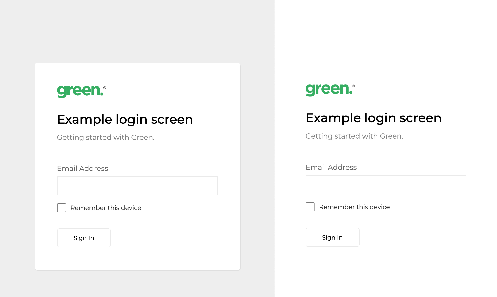

**Link to app:** https://green-energy-task.herokuapp.com/

### Page Layout

The closest free font to gotham was **Montserrat**, so I used it for this example.

### Button Pressed

Here a short **animation** is displayed on button press.

### Mobile Responsive

Once the screen size reaches 520px the **border** is **disabled** and the whole component background becomes **white**.

### Welcome Screen

Once the sign in button is pressed a welcome message replaces the sub-heading using the entered email address.

